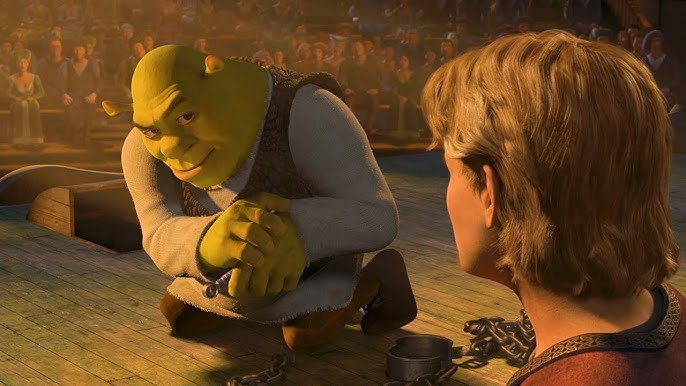

# ResponsiveUI

Учебный Android-проект — вёрстка элемента списка в стиле карточки YouTube/соцсети.

## Что внутри

Один экран с карточкой видео-поста:

- Круглый аватар + имя канала + источник и просмотры + кнопка закладки
- Заголовок поста
- Превью-изображение (16:9, centerCrop)
- Теги с выделенной категорией (жёлтый pill-чип)
- Панель действий: лайки, репосты, поделиться

## Стек

- **Language:** Kotlin
- **Min SDK:** 24
- **Compile SDK:** 36.1
- **UI:** XML layouts, ConstraintLayout, Material3
- **Компоненты:** `ShapeableImageView`, `LinearLayout`, `ScrollView`

## Запуск

1. Открой проект в Android Studio
2. Подключи устройство или запусти эмулятор
3. Нажми Run

## Скриншот

